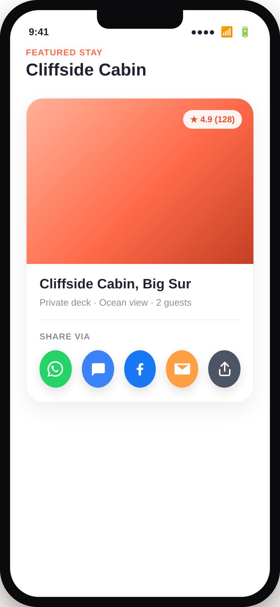
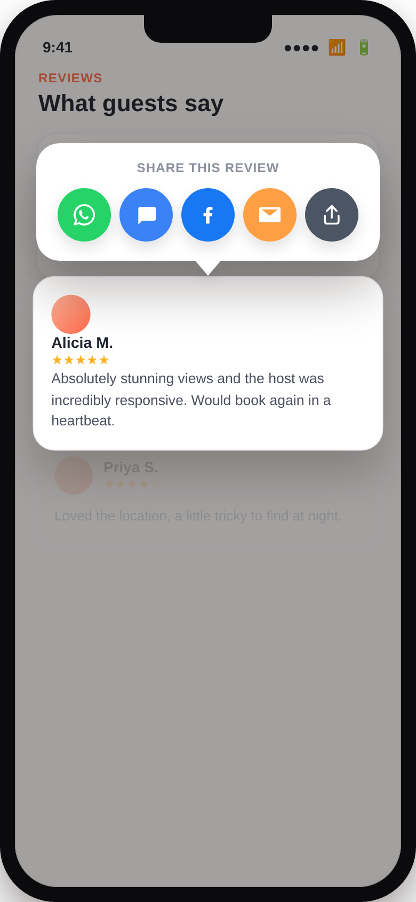

# quick_share_row

A ready-made row of per-channel share icons — WhatsApp, SMS, Facebook,
Email, and the system share sheet — plus a long-press popup variant, so
you don't have to hand-wire `url_launcher` deep links every time a screen
needs a share UI.

Extracted and generalized from a production app's review and booking
screens: the per-channel URL schemes (`wa.me`, `sms:`, Facebook's
`sharer.php`, `mailto:`) and the little colored, tooltip-labeled icon
button, without anything specific to that original app baked in.

<p align="center">
  
  &nbsp;&nbsp;
  
</p>

## Features

- `ShareButtonsRow` — an inline row of channel buttons.
- `showShareMenu` — the same row in a floating popup anchored at a
  tap/long-press position (a context-menu-style share UI).
- `ShareUtils` — the underlying per-channel methods, callable directly if
  you want to trigger one specific channel from your own custom UI.
- Fully configurable: pick which channels to show and in what order,
  override any channel's icon/color/label, or swap the icon for your own
  widget (a brand SVG, for example) with no extra dependency required.
- No forced UI-feedback dependency — a channel that fails to launch calls
  an optional `onError` callback instead of showing a toast/snackbar for
  you.

## Install

```yaml
dependencies:
  quick_share_row: ^0.1.0
```

## Usage

### Inline row

```dart
import 'package:quick_share_row/quick_share_row.dart';

ShareButtonsRow(
  message: 'Check out this listing!\n\nhttps://example.com/item/42',
  url: 'https://example.com/item/42', // used for Facebook specifically — see note below
  subject: 'A listing you might like', // used for Email + system share
)
```

### Long-press popup

```dart
GestureDetector(
  onLongPressStart: (details) => showShareMenu(
    context,
    details.globalPosition,
    message: 'Check out this listing!\n\nhttps://example.com/item/42',
    url: 'https://example.com/item/42',
  ),
  child: YourListItem(),
)
```

### Picking channels / one channel directly

```dart
// Only WhatsApp and the system sheet:
ShareButtonsRow(
  message: message,
  channels: [ShareChannel.whatsapp, ShareChannel.system],
)

// Trigger one channel yourself, e.g. from a menu item you already have:
ShareUtils.toWhatsApp(message, onError: (e) => print('Failed: $e'));
```

### Customizing a channel

```dart
ShareButtonsRow(
  message: message,
  channels: [
    ShareChannel.whatsapp.copyWith(color: Colors.teal),
    ShareChannel.system,
  ],
)
```

## Why `url` is separate from `message`

Every channel except Facebook accepts free text, so `message` (typically
your text plus the link, already concatenated) is what WhatsApp, SMS,
Email, and the system share sheet all use. Facebook's web share dialog
only ever accepts a bare URL — it has no field for custom text — so pass
just the link via `url` if you're including Facebook in your channel
list. If you omit `url`, it falls back to `message`, which is rarely what
you actually want once `message` has more than a link in it.

## A note on dependency version constraints

This package's `pubspec.yaml` was written without network access to
pub.dev, so the `share_plus`/`url_launcher`/`flutter_lints` version
ranges are deliberately wide rather than pinned to "current." Run
`flutter pub get` and then `flutter pub outdated` before publishing, and
tighten the constraints to whatever actually resolves.

## License

MIT — see `LICENSE`.
